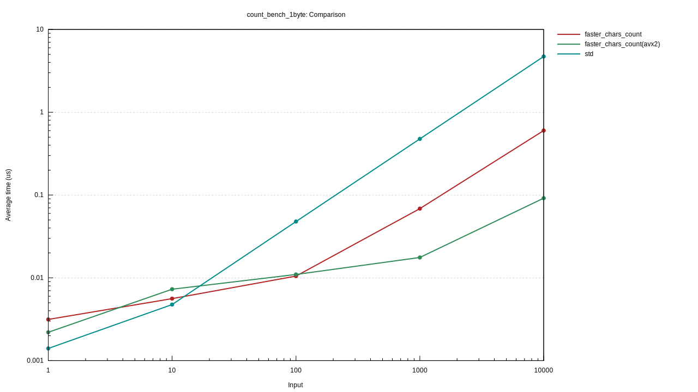

Library for counting length of chars faster than `Chars::count()`

Idea is from [UTF-8のコードポイントはどうやって高速に数えるか](https://qiita.com/saka1_p/items/ff49d981cfd56f3588cc), and [UTF-8のコードポイントはどうやってもっと高速に数えるか](https://qiita.com/umezawatakeshi/items/ed23935788756c800b86).


## usage
```
//before
"Hello, world!".chars().count();

//after
"Hello, world!".chars_count();
```

## bench
repeated "a" (only 1byte utf8)

|Length|std|chars_count|chars_count(avx2)|
|---|---|---|---|
|1|1.3906 ns|3.1607 ns|2.1750 ns|
|10|4.7844 ns|5.6093 ns|7.2465 ns|
|100|47.630 ns|10.607 ns|11.265 ns|
|1000|475.17 ns|67.364 ns|17.839 ns|
|10000|4.7231 us|604.66 ns|91.757 ns|



repeated "錆" (only 3byte utf8)

|Length|std|chars_count|chars_count(avx2)|
|---|---|---|---|
|1|2.4324 ns|4.5069 ns|4.2662 ns|
|10|13.947 ns|10.267 ns|11.984 ns|
|100|143.74 ns|23.935 ns|28.758 ns|
|1000|1.4210 us |193.98 ns|40.435 ns |
|10000|1.8505 us|270.60 ns|14.206 us|


This is a peformance bench branch.
Functions in lib.rs is to compare how we can improve the performance.


## future plan
sse (128bit)

avx512
[UTF-8のコードポイントはどうやってAVX-512で高速に数えるか](https://qiita.com/umezawatakeshi/items/fca066b2fd3dcf9cbec9)
